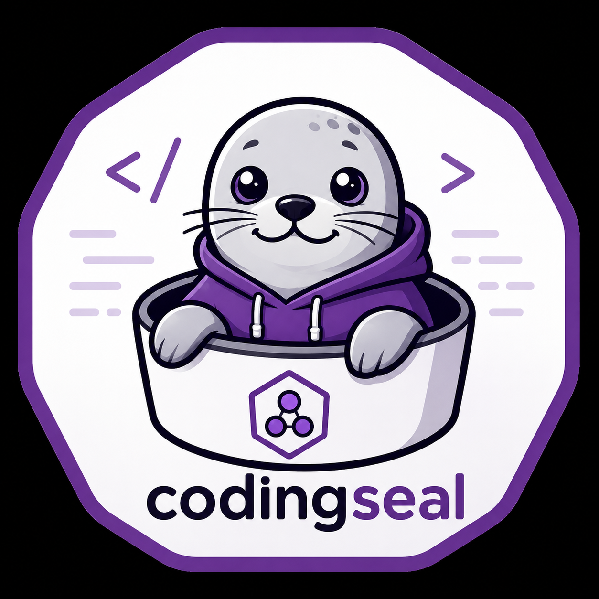

<div align="center">
  

  # CodingSeal — Claude Code in a Podman Container

  *Give Claude Code unrestricted tool access inside a rootless Podman container.
  Your host stays completely isolated. Connect via terminal, VS Code, from a remote machine,
  or drive it live from claude.ai/code and the Claude app with Remote Control.*
</div>

---

**What you get:**
- Claude Code with full permissions inside a container — `rm -rf /` can only hurt the container, never your host
- Zero-prompt startup — authenticate once, then every run drops straight into Claude (no theme picker, trust dialog, or re-login)
- VS Code Remote-SSH support — Claude's bash commands run inside the container, not on your host
- Remote Control — expose the container to claude.ai/code and the Claude mobile app, then steer it from your phone or browser (outbound HTTPS only, no inbound port)
- Selectable project directories — only the folders you explicitly pass with `-p` are visible to Claude
- Optional GPU passthrough — NVIDIA and AMD both supported

---

```
┌──────────────────────────────────────────────────────────────┐
│                       HOST MACHINE                           │
│                                                              │
│  ┌────────────────────────────────────────────────────────┐  │
│  │                PODMAN CONTAINER                        │  │
│  │                                                        │  │
│  │   claude ──► /home/you/projects/myapp     ◄── ─ ─ ┐   │  │
│  │      │       /home/you/projects/lib       ◄── ─ ─ ┤   │  │
│  │      │       /home/you/datasets/          ◄── ─ ─ ┘   │  │
│  │      │                                               │  │  │
│  │   sshd (port 2222) ◄── VS Code Remote-SSH           │  │  │
│  └────────────────────────────────────────────────────────┘  │
│       bind-mounts ─ ─ ─ ─ ─ ─ ─ ─ ─ ─ ─ ─┘                 │
│       host dir: ~/.codingseal/claude-auth → ~/.claude/ (token)│
└──────────────────────────────────────────────────────────────┘
```

---

## Table of Contents

1. [Prerequisites](#1-prerequisites)
2. [Quick Start](#2-quick-start)
3. [Security Model](#3-security-model)
4. [First-Time Authentication](#4-first-time-authentication)
5. [Mounting Multiple Projects](#5-mounting-multiple-projects)
6. [Connection Modes](#6-connection-modes)
   - [Mode A: Local Interactive Terminal](#mode-a-local-interactive-terminal)
   - [Mode B: VS Code Remote-SSH](#mode-b-vs-code-remote-ssh)
   - [Mode C: Access from a Remote Machine](#mode-c-access-from-a-remote-machine)
   - [Mode D: Remote Control — drive from claude.ai/code](#mode-d-remote-control--drive-from-claudeaicode)
7. [GPU Support](#7-gpu-support)
8. [Advanced: Sharing Host Python Packages](#8-advanced-sharing-host-python-packages)
9. [Updating the Image](#9-updating-the-image)
10. [Troubleshooting](#10-troubleshooting)

---

## 1. Prerequisites

| Requirement | How to check |
|---|---|
| **Podman >= 4.3** | `podman --version` — install: [podman.io](https://podman.io/docs/installation) |
| **Anthropic account** | [console.anthropic.com](https://console.anthropic.com) |
| **SSH key pair** | `ls ~/.ssh/id_*.pub` — generate: `ssh-keygen -t ed25519` |
| **VS Code** *(optional)* | With [Remote - SSH](https://marketplace.visualstudio.com/items?itemName=ms-vscode-remote.remote-ssh) extension |
| **NVIDIA drivers** *(optional)* | Required only for `--gpu-nvidia` — see [Section 7](#7-gpu-support) |

---

## 2. Quick Start

### First time (do this once)

```bash
# 1. Clone and configure
git clone https://github.com/TorbenGl/codingseal.git
cd codingseal
cp .env.example .env
#    Edit .env — set SSH_PUBLIC_KEY to the contents of ~/.ssh/id_ed25519.pub

# 2. Build the image (~5 minutes)
podman build -t coding-seal:latest .

# 3. Authenticate Claude once (see Section 4 for all options).
#    Recommended: generate a long-lived token and put it in .env
scripts/run.sh --setup-token
#    → open the printed URL, log in, copy the token, then add to .env:
#      CLAUDE_CODE_OAUTH_TOKEN=sk-ant-oat01-...

# 4. Start working — drops straight into Claude, no prompts
set -a && source .env && set +a
scripts/run.sh -p ~/projects/myproject
```

### Every time after that

```bash
set -a && source .env && set +a
scripts/run.sh -p ~/projects/myproject
# Claude starts immediately — no auth prompt, permissions pre-configured
```

---

## 3. Security Model

### Why full permissions are safe here

Claude Code normally prompts before every file write, shell command, and web request. Those prompts are disabled inside this container. This is intentional and safe because:

- Claude can only see directories you explicitly pass with `-p`. Nothing else on your drive is mounted.
- Even if Claude runs `rm -rf /`, it destroys only the container's writable layer. The container exits. Start a new one.
- The container shares your kernel but has no access to host processes, network interfaces beyond the published ports, or the rest of your filesystem.

**The container is the security boundary. Claude's own permission system is redundant here.**

### What Claude cannot do

| Cannot do | Why |
|---|---|
| Read files outside `-p` mounts | Not mounted |
| Access other users' data | User-namespace isolation |
| Persist changes outside project mounts and the auth volume | `--rm` removes the container on exit |
| Reach the host's running processes | PID namespace is separate |

---

## 4. First-Time Authentication

Claude needs credentials to start. After one-time setup, **every run drops you straight into Claude — no theme picker, no "trust this folder?" prompt, no login.** The image bakes in the settings that suppress those wizards, and `CLAUDE_CONFIG_DIR` points Claude's entire state directory at a fixed host folder (`~/.codingseal/claude-auth`) so your login persists across runs.

> **Why a host folder and not a podman named volume?** A named volume lives under podman's storage root, and the VS Code snap relocates that root into its sandbox (`~/snap/code/<rev>/…`). Logging in from one place and restarting from another then hits two different, empty volumes — so the login "vanishes". A bind-mounted host folder is the same path everywhere, snap or not.

Pick **one** of these three methods.

### Option A — Long-lived OAuth token (recommended for Claude subscriptions)

Generate a token once and store it in `.env`. Works with a Claude Pro/Max subscription — no API billing.

```bash
scripts/run.sh --setup-token
# A URL is printed → open it in your host browser → log in →
# copy the printed token (starts with sk-ant-oat...)
```

Paste it into `.env`:
```bash
CLAUDE_CODE_OAUTH_TOKEN=sk-ant-oat01-...
```

Done. Every run is now fully non-interactive.

### Option B — Persistent browser login (saved in the volume)

Leave the token/key blank in `.env` and log in once:

```bash
set -a && source .env && set +a
scripts/run.sh --auth
# URL → host browser → log in → paste code back → container exits
```

On Linux there is no OS keychain, so Claude saves the login as a plaintext file —
`.credentials.json` (mode 600) — inside `CLAUDE_CONFIG_DIR`, which is the host
folder below. `--auth` verifies the file landed and prints `✅ Login saved…` on
success (or a `⚠️` with next steps if the browser step wasn't completed).

The login is saved in a plain host folder:
```
~/.codingseal/claude-auth/.credentials.json
```
It is user-scoped on your host (mode 600, only you can read it) and reused automatically on every subsequent run — from a normal terminal or the VS Code snap alike. Security is equivalent to storing the token at `~/.claude/` directly on your host. Override the location with `CLAUDE_AUTH_DIR`.

Remove saved credentials with:
```bash
rm -rf ~/.codingseal/claude-auth
```

### Option C — API key (pay-per-token API billing)

Set your [console.anthropic.com](https://console.anthropic.com/account/keys) key in `.env`:

```bash
ANTHROPIC_API_KEY=sk-ant-api03-...
```

Passed as an environment variable each run. Nothing is stored in the container.

### Why there are no setup prompts

The container is configured so Claude never stops to ask:

| Prompt you would normally see | How it's suppressed |
|---|---|
| Theme / color picker | `hasCompletedOnboarding: true` seeded in `.claude.json` |
| "Do you trust the files in this folder?" | `projects["/"].hasTrustDialogAccepted: true` — trust inherits down to every mounted dir |
| Bypass-permissions mode (no per-tool prompts) | `permissions.defaultMode: bypassPermissions` in settings.json |
| "Yes, I accept bypass mode" warning | `skipDangerousModePermissionPrompt: true` in settings.json (the durable key; the old `.claude.json` flag gets migrated away each run) |
| "Cannot skip permissions as root" | Claude runs as a **non-root `coder` user** — the guard only triggers for root, so the check never fires (no env trick needed) |
| "Try the new fullscreen renderer?" | `tui: "default"` pinned in settings.json — any explicit `tui` value suppresses the upsell (use `"fullscreen"` if you prefer the flicker-free alt-screen UI) |
| Re-login on every run | `CLAUDE_CONFIG_DIR` stores credentials in the persistent host auth folder |
| Prompts/login still appear over **SSH / VS Code** | sshd starts a clean environment, so the entrypoint injects `CLAUDE_CONFIG_DIR` and your credential into every SSH session via sshd's `SetEnv` |

These are applied automatically by [entrypoint.sh](entrypoint.sh) and [config/claude-settings.json](config/claude-settings.json) — you don't need to do anything.

> **Authenticating for the SSH / VS Code path:** because SSH sessions don't see `podman run --env` values directly, the entrypoint forwards your `.env` credential (`CLAUDE_CODE_OAUTH_TOKEN` or `ANTHROPIC_API_KEY`) into SSH sessions for you. A volume-stored `--auth` login (Option B) also works over SSH, since the credentials file lives in the volume that every session reads. For headless/remote use the token in `.env` (Option A) is the most reliable, since it needs no interactive step at all.

---

## 5. Mounting Multiple Projects

Pass `-p` once per directory. Use it as many times as you need:

```bash
scripts/run.sh \
  -p ~/projects/myapp \
  -p ~/projects/shared-lib \
  -p ~/projects/infra \
  -p ~/datasets/training-data
```

Claude **opens in the first `-p` directory** (its working directory), so it starts right in your code instead of the empty `/home/coder` home. The other `-p` directories stay fully accessible by their paths.

Each directory is mounted at the **same absolute path** inside the container. If your project is at `/home/alice/projects/myapp` on the host, Claude sees it at `/home/alice/projects/myapp` inside too. This means:

- `git` history, branches, and remotes all work
- Relative imports across your projects work
- Symlinks resolve correctly
- You can open the same directory in VS Code on the host and in the container simultaneously

Claude can read and write all mounted directories. It cannot access anything else.

> **SELinux note (Fedora / RHEL):** The `:Z` label in `run.sh` is already set for you. Never omit it on SELinux-enforcing hosts — you will get `Permission denied` errors on mounts with no obvious cause.

---

## 6. Connection Modes

### Mode A: Local Interactive Terminal

The default. A TTY is allocated and Claude starts immediately.

```bash
set -a && source .env && set +a
scripts/run.sh -p ~/projects/myproject
```

You land directly in `claude`. Type your task. Claude's bash commands run in the container.

To get a plain shell instead (note `--userns=keep-id --user 0`, which `run.sh` adds for you — the entrypoint starts as root then drops you to `coder`):
```bash
podman run -it --rm \
  --userns=keep-id --user 0 \
  --volume ~/.codingseal/claude-auth:/home/coder/.claude:Z \
  --env SSH_PUBLIC_KEY \
  --volume ~/projects/myproject:~/projects/myproject:Z \
  localhost/coding-seal:latest \
  bash
# (add `--publish 127.0.0.1:2222:2222` only if you also want to SSH in — see Mode B)
```

---

### Mode B: VS Code Remote-SSH

This is the most powerful mode. VS Code connects into the running container over SSH. **Everything in VS Code — the terminal, extensions, language servers, and Claude Code itself — runs inside the container.**

#### Why this is important

When VS Code's Remote-SSH connects to the container, it installs **VS Code Server** inside the container. From that point on:

| VS Code feature | Where it runs |
|---|---|
| Integrated terminal | Container bash |
| Claude Code extension | Inside the container |
| Claude's Bash tool | Container process — **not your host** |
| File operations Claude performs | Your mounted project dirs only |
| Language servers (Pylance, etc.) | Inside the container |

This is exactly what you want: Claude operates in a sandboxed environment with no ability to affect your host.

#### Step-by-step setup

**Step 1 — Start the container in SSH mode**

```bash
set -a && source .env && set +a
scripts/run.sh --ssh -p ~/projects/myproject
```

Output:
```
Starting container 'coding-seal'...

  SSH into the container:
    ssh -p 2222 -i ~/.ssh/id_ed25519 coder@localhost

  Then start Claude:
    claude

  Stop the container:
    podman stop coding-seal
```

**Step 2 — Add the container to your SSH config**

```bash
cat >> ~/.ssh/config << 'EOF'

Host claude-container
    HostName 127.0.0.1
    Port 2222
    User coder
    IdentityFile ~/.ssh/id_ed25519
    StrictHostKeyChecking no
    UserKnownHostsFile /dev/null
EOF
```

> `StrictHostKeyChecking no` is safe here because the connection is loopback-only. The SSH host key changes when a new container starts — this setting avoids the warning.

**Step 3 — Connect with VS Code**

1. Open the Command Palette: `Ctrl+Shift+P` (Linux/Windows) or `Cmd+Shift+P` (Mac)
2. Run: **Remote-SSH: Connect to Host...**
3. Select **claude-container**
4. VS Code opens a new window. On the first connection it installs VS Code Server inside the container — this takes about 30 seconds.

**Step 4 — Install Claude Code on the remote**

In the new VS Code window (which is now running inside the container):
1. Open the Extensions panel (`Ctrl+Shift+X`)
2. Search for **Claude Code**
3. Click **Install in SSH: claude-container**

On subsequent connections, the extension is already installed.

**Step 5 — Verify you are inside the container**

Open the integrated terminal (`` Ctrl+` ``):

```bash
# These confirm you are in the container, not on your host:
hostname          # prints a short container ID hash
which claude      # /usr/local/bin/claude — the container's installation
ls ~/projects/    # your mounted project directories
```

**Step 6 — Start Claude**

From the VS Code integrated terminal:

```bash
claude
# or if you want to be explicit:
claude
```

From this point on, every bash command Claude runs executes as a container process. Claude cannot touch your host filesystem beyond what is mounted.

**Step 7 — Stop the container when done**

```bash
podman stop coding-seal
```

---

### Mode C: Access from a Remote Machine

The SSH port is bound to `127.0.0.1` only — it is not reachable directly from other machines. To connect from a separate computer, tunnel through the host first.

**Option 1 — SSH tunnel (two terminals)**

On your local machine:
```bash
# Terminal 1: keep this running — it forwards local port 2222 to the container
ssh -N -L 2222:localhost:2222 youruser@your-workstation-ip

# Terminal 2: connect to the container through the tunnel
ssh -p 2222 -i ~/.ssh/id_ed25519 coder@localhost
```

**Option 2 — ProxyJump (one step, works with VS Code)**

Add to your local `~/.ssh/config`:

```
Host your-workstation
    HostName your-workstation-ip
    User youruser

Host claude-remote
    HostName 127.0.0.1
    Port 2222
    User coder
    IdentityFile ~/.ssh/id_ed25519
    ProxyJump your-workstation
    StrictHostKeyChecking no
    UserKnownHostsFile /dev/null
```

Then in VS Code's Remote-SSH: connect to `claude-remote`. VS Code hops through your workstation into the container transparently.

---

### Mode D: Remote Control — drive from claude.ai/code

Instead of connecting *into* the container (SSH/VS Code), Remote Control runs Claude **inside the container** and exposes that session to [claude.ai/code](https://claude.ai/code) and the Claude mobile app. You drive the container from your phone or any browser; all work still happens in the container, against your mounted projects.

The container makes **outbound HTTPS only** — it registers with the Anthropic API and polls for work, so it opens **no inbound port** and needs no SSH or tunnel. This is the easiest way to reach the container from another machine.

```bash
set -a && source .env && set +a
scripts/run.sh --remote -p ~/projects/myproject
```

A session URL prints in the terminal (press **spacebar** for a QR code to open it on your phone). Open that URL — or find the session in the list at [claude.ai/code](https://claude.ai/code) / the Claude app — and start steering. Keep the process running: it hosts the session, so stopping it ends Remote Control.

> **Authentication is different for this mode.** Remote Control needs a **full claude.ai login** — the credential from `scripts/run.sh --auth` (Option B), stored as `~/.codingseal/claude-auth/.credentials.json`. The recommended `CLAUDE_CODE_OAUTH_TOKEN` (from `--setup-token`, Option A) and `ANTHROPIC_API_KEY` (Option C) are **inference-only** and are rejected by Remote Control, so `--remote` deliberately does **not** pass them. If you've only used the token method, run `scripts/run.sh --auth` once first.

| Requirement | Notes |
|---|---|
| **Plan** | Pro, Max, Team, or Enterprise. API keys are not supported. On Team/Enterprise an Owner must enable the **Remote Control** toggle in [Claude Code admin settings](https://claude.ai/admin-settings/claude-code). |
| **Login** | A full claude.ai session login (`--auth`). A long-lived token / API key won't work. |
| **Claude Code version** | The image installs the latest CLI; Remote Control server mode needs v2.1.51+ — rebuild the image if yours is older. |

Because nothing inbound is exposed, this works through NAT and firewalls with no port forwarding — a simpler alternative to [Mode C](#mode-c-access-from-a-remote-machine) when you just want to reach the container from elsewhere.

---

## 7. GPU Support

### NVIDIA

Requirements: NVIDIA drivers installed on the host. No additional container toolkit needed.

```bash
scripts/run.sh --gpu-nvidia -p ~/projects/ml-project
```

This passes `/dev/nvidia0`, `/dev/nvidiactl`, `/dev/nvidia-uvm`, `/dev/nvidia-modeset`, `/dev/nvidia-uvm-tools` into the container.

> `/dev/nvidia-caps/` files are **not** needed for compute workloads (only for MIG mode).

To verify GPU access inside the container:
```bash
# Inside the container:
apt-get install -y nvidia-utils-550   # match your driver version
nvidia-smi
```

**CDI (future-proof, Podman 5.0+)**

If you have `/etc/cdi/nvidia.yaml` (from `nvidia-ctk cdi generate`), add this to `~/.config/containers/containers.conf`:

```toml
[engine]
cdi_spec_dirs = ["/etc/cdi"]
```

Then use `--device nvidia.com/gpu=all` instead of `--gpu-nvidia`. This is the preferred interface going forward.

### AMD

Requirements: ROCm-compatible AMD GPU and drivers.

```bash
scripts/run.sh --gpu-amd -p ~/projects/ml-project
```

Passes `--device /dev/kfd --device /dev/dri` with `--group-add keep-groups` so the container inherits your host user's `render` and `video` group memberships.

To verify:
```bash
# Inside the container:
apt-get install -y rocm-smi
rocm-smi
```

### No GPU

Default — no flag needed:
```bash
scripts/run.sh -p ~/projects/myproject
```

---

## 8. Advanced: Sharing Host Python Packages

If you have a large Python environment on your host and want to avoid reinstalling packages in the container, mount your host's site-packages read-only.

> This works reliably only when the host and container use the **same OS and Python version**. This repo uses `ubuntu:24.04` as the base — if your host is also Ubuntu 24.04, native `.so` extensions are ABI-compatible.

```bash
# Find your host site-packages paths
python3 -c "import site; print('\n'.join(site.getsitepackages()))"

# Add to the run command
podman run -it --rm \
  --userns=keep-id --user 0 \
  --volume ~/.codingseal/claude-auth:/home/coder/.claude:Z \
  --publish 127.0.0.1:2222:2222 \
  --env ANTHROPIC_API_KEY \
  --env SSH_PUBLIC_KEY \
  --volume ~/projects/myproject:~/projects/myproject:Z \
  --volume /usr/lib/python3/dist-packages:/mnt/host-python/dist-packages:ro,Z \
  --volume ~/.local/lib/python3.12/site-packages:/mnt/host-python/user-packages:ro,Z \
  --env PYTHONPATH=/mnt/host-python/dist-packages:/mnt/host-python/user-packages \
  localhost/coding-seal:latest \
  claude
```

Packages installed with `uv pip install` inside the container go into the container's own layer and don't affect your host.

---

## 9. Updating the Image

**When do you need to rebuild?**

| You changed… | Rebuild needed? |
|---|---|
| `Containerfile`, `entrypoint.sh`, `config/sshd_config`, `config/claude-settings.json` (e.g. the `coder` user, the `tui` setting) | **Yes** — these are baked into the image: `podman build -t coding-seal:latest .` |
| `scripts/run.sh`, `.env` (mounts, GPU flags, auth dir, tokens) | No — they take effect on the next run |

**Full update** (base OS + Node.js + Claude Code + uv):
```bash
podman build --pull=newer -t coding-seal:latest .
```

**Custom Python version:**
```bash
podman build --build-arg PYTHON_VERSION=3.11 -t coding-seal:py311 .
CLAUDE_IMAGE=localhost/coding-seal:py311 scripts/run.sh -p ~/projects/myproject
```

---

## 10. Troubleshooting

| Symptom | Likely cause | Fix |
|---|---|---|
| Theme picker / trust prompt / login appears | Image built before these fixes | Rebuild: `podman build -t coding-seal:latest .` (seeds the wizard-suppression state) |
| `claude` asks to authenticate on every run | No saved credentials, or the `--auth` browser step was never completed | Most reliable: set `CLAUDE_CODE_OAUTH_TOKEN` in `.env` (via `--setup-token`). For `--auth`, confirm it printed `✅ Login saved…`; verify with `ls -l ~/.codingseal/claude-auth/.credentials.json` |
| `--auth` says it saved, but the next run still asks to log in | Older versions stored auth in a podman **named volume**, whose location follows podman's storage root — and the VS Code snap relocates that root into its sandbox (`~/snap/code/<rev>/…`), so login and restart hit different empty volumes | Fixed: `run.sh` now bind-mounts a fixed host folder (`~/.codingseal/claude-auth`) that's identical in every context. Just `scripts/run.sh --auth` once more. (You can delete the stale `claude-auth` named volume: `podman volume rm claude-auth`.) |
| `--auth` login doesn't stick | Browser code not pasted back, or `~/.codingseal/claude-auth` was deleted between runs | Re-run `scripts/run.sh --auth`, paste the code when prompted, and confirm `~/.codingseal/claude-auth/.credentials.json` exists |
| `--dangerously-skip-permissions cannot be used with root` | Old image that ran as root | Rebuild — the image now runs Claude as the non-root `coder` user; confirm with `podman exec coding-seal whoami` (should print `coder` for the Claude process) |
| `Invalid API key` | Bad/expired credential | Regenerate with `scripts/run.sh --setup-token` and update `.env` |
| `rootlessport listen tcp 127.0.0.1:2222: bind: address already in use` | Another container already holds the SSH port | Only `--ssh` publishes 2222, so local and `--remote` runs no longer collide. If you still see it, an `--ssh` container is up — `podman ps`, then `podman stop coding-seal` (or `--port 2223` for a second one). A container started from a normal terminal may be invisible to `podman ps` run inside the VS Code snap (different storage root) — stop it from the terminal you started it in |
| `ssh: connect to host localhost port 2222: Connection refused` | Container not running or sshd didn't start | `podman ps`; `podman logs coding-seal` for sshd errors |
| `Permission denied (publickey)` via SSH | Wrong key or key not injected | Check `SSH_PUBLIC_KEY` is set; `podman exec --user coder coding-seal cat /home/coder/.ssh/authorized_keys` |
| VS Code says "Cannot connect to remote" | Container not running | Start with `scripts/run.sh --ssh -p ...` first |
| Claude Code extension runs on local, not inside container | Extension not installed on the remote | Extensions panel → Claude Code → "Install in SSH: claude-container" |
| Claude's bash commands run on your host | VS Code not connected to container | Check VS Code title bar shows `[SSH: claude-container]` |
| `claude: command not found` | PATH issue | `which claude` inside container; rebuild if missing |
| Project files owned by the wrong UID / not writable | `--userns=keep-id` not applied | `run.sh` sets it so your host user maps to `coder`; verify files you create inside appear owned by you on the host |
| `Permission denied` on project files | SELinux denying the mount | The `:Z` flag in `run.sh` handles this — verify you are using `run.sh` not a manual command |
| NVIDIA GPU not visible inside container | Devices not passed through | Use `--gpu-nvidia`; verify `ls -l /dev/nvidia*` on host shows your devices |
| AMD GPU not visible | Group membership issue | `--gpu-amd` includes `--group-add keep-groups`; check `/dev/kfd` exists on host |
| `claude auth login` URL doesn't open a browser | Container has no display | This is expected — copy the URL, paste it into your **host** browser |
| VS Code keeps disconnecting | Missing SSH keepalive | `sshd_config` already sets `ClientAliveInterval 30`; check your local `~/.ssh/config` too |
| `--remote`: "Remote Control requires a full-scope login token" | The container is using a `CLAUDE_CODE_OAUTH_TOKEN` / `ANTHROPIC_API_KEY` — these are inference-only | Run `scripts/run.sh --auth` once to save a full claude.ai login, then `scripts/run.sh --remote`. `--remote` already drops the token/key env vars, so an existing `.credentials.json` is used |
| `--remote`: "Remote Control requires a claude.ai subscription" / "not yet enabled" | No claude.ai login, or feature not rolled out to your account | `scripts/run.sh --auth` to log in; confirm your plan supports it (Pro/Max/Team/Enterprise). On Team/Enterprise an Owner must enable the Remote Control toggle in admin settings |
| `--remote`: no session URL appears / `claude: command not found` for `remote-control` | Image predates Remote Control (needs Claude Code v2.1.51+) | Rebuild: `podman build --pull=newer -t coding-seal:latest .` |

---

## Repository layout

```
codingseal/
├── codingseal.png            ← Project logo
├── README.md                 ← This tutorial
├── Containerfile             ← ubuntu:24.04 + Node LTS + Claude Code + uv + Python + sshd
├── entrypoint.sh             ← Container startup: injects SSH key, starts sshd, runs CMD
├── .env.example              ← Copy to .env and fill in your credentials
├── scripts/
│   └── run.sh                ← Wrapper: --setup-token, --auth, --gpu-nvidia/amd, -p PATH, --remote, --ssh
└── config/
    ├── sshd_config           ← Port 2222, key-only auth, VS Code keepalive
    └── claude-settings.json  ← dangerouslySkipPermissions + full allow list
```
